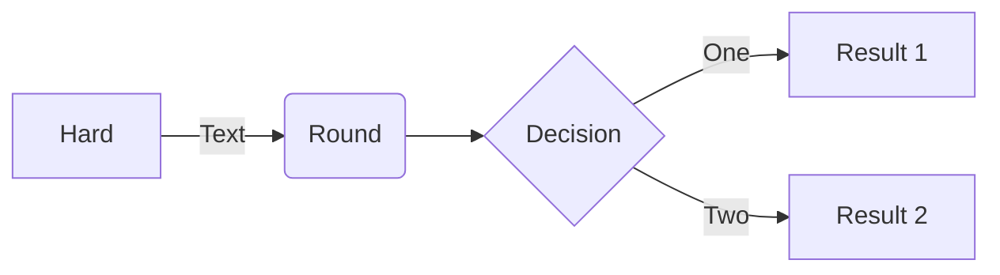

> [!NOTE]
> Information the user should notice even if skimming.

> [!TIP]
> Optional information to help a user be more successful.

> [!IMPORTANT]
> Essential information required for user success.

> [!CAUTION]
> Negative potential consequences of an action.

> [!WARNING]
> Dangerous certain consequences of an action.

This sentence uses `$` delimiters to show math inline:  $\sqrt{3x-1}+(1+x)^2$

# [Linux](#tab/linux)

Content for Linux...

# [Windows](#tab/windows)

Content for Windows...

---
